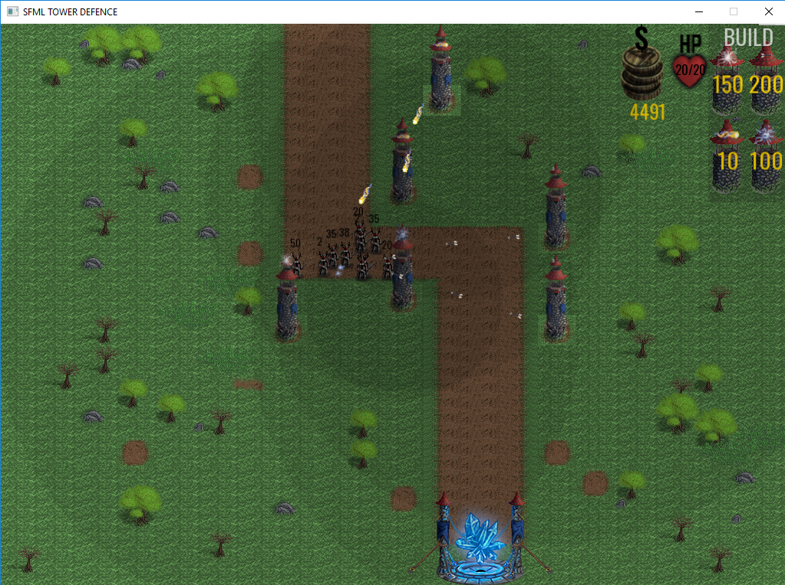

# TOWER-DEFENCE-C-
tower defence written in c++/SFML 

Some things needs to be rewritten like move pattern functions in class "Enemy" <its writtem very poorly, probably using A* algorithm would be better than 100 switch cases>.
Todo in future times:

1.) whole new map select state, because present implementation only has 1 map generated from file called map.ini, first 4 coordinates stands for tile width, tile height and number on tiles on x and y axis and also every tile in map.ini has its equivalent as .png file :P.

2.) if the move pattern for enemies would be predicted (because movement pattern for enemies is selected for like every few pixels) also the bullets could use some kind of chasing algorithm( because right now every bullet has shared pointer of targeted enemy and its pretty much impossible for bullets to miss).

3.) settings state where u could choose your screen resolution.

4.) some kind of wave state, i mean the time when all enemies are gone and u have some time before the next wave.

5.) maybe wave indicatior which would tell u how many enemies are going in next wave, because right now its like when u kill all remaining enemies the next wave starts. 

6.) Moving hero like in Kingdom Rush? 

7.) Some contex menu when u hover over the tower it shows u its stats (damage, range, cost and stuff) 

